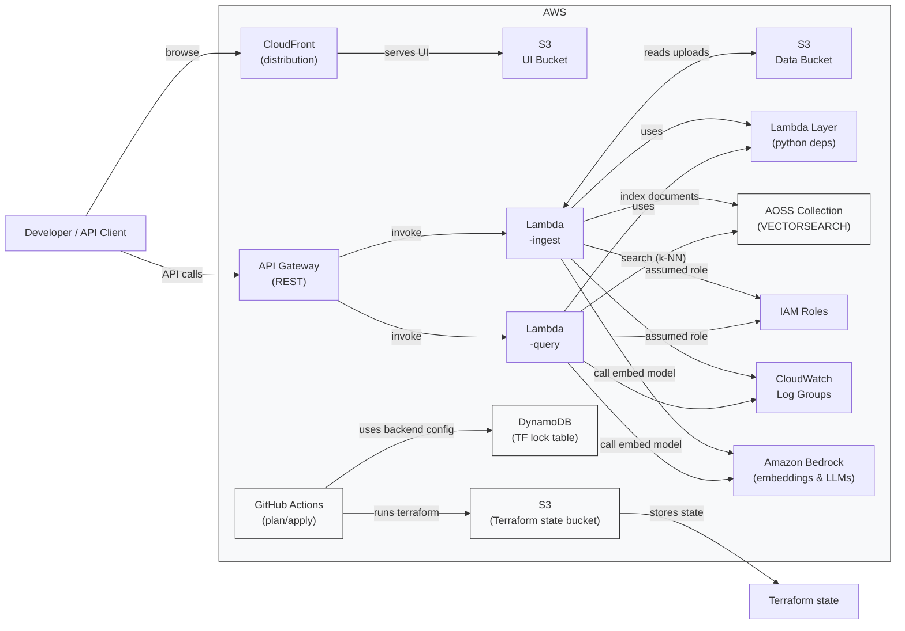

# Architecture Diagram

The following diagram shows the resources provisioned by this repository and how they connect.

```mermaid
flowchart LR
  subgraph AWS
    S3Data["S3\nData Bucket"]
    S3UI["S3\nUI Bucket"]
    CF["CloudFront\n(distribution)"]
    APIGW["API Gateway\n(REST)"]
    LambdaIngest["Lambda\n-ingest"]
    LambdaQuery["Lambda\n-query"]
    Layer["Lambda Layer\n(python deps)"]
    OpenSearch["AOSS Collection\n(VECTORSEARCH)"]
    DynamoDB["DynamoDB\n(TF lock table)"]
    TFStateS3["S3\n(Terraform state bucket)"]
    IAM[IAM Roles]
    CloudWatch["CloudWatch\nLog Groups"]
    Bedrock["Amazon Bedrock\n(embeddings & LLMs)"]
    GitHubCI["GitHub Actions\n(plan/apply)"]
  end

  %% User and client
  User[Developer / API Client]

  %% Frontend
  User -->|browse| CF
  CF -->|serves UI| S3UI

  %% API -> Lambdas
  User -->|API calls| APIGW
  APIGW -->|invoke| LambdaIngest
  APIGW -->|invoke| LambdaQuery

  %% Lambdas interactions
  LambdaIngest -->|index documents| OpenSearch
  LambdaQuery -->|"search (k-NN)"| OpenSearch
  LambdaIngest -->|call embed model| Bedrock
  LambdaQuery -->|call embed model| Bedrock
  LambdaIngest <-->|reads uploads| S3Data

  %% Shared pieces
  LambdaIngest -->|uses| Layer
  LambdaQuery -->|uses| Layer
  LambdaIngest -->|assumed role| IAM
  LambdaQuery -->|assumed role| IAM
  LambdaIngest --> CloudWatch
  LambdaQuery --> CloudWatch

  %% Terraform / CI
  GitHubCI -->|runs terraform| TFStateS3
  GitHubCI -->|uses backend config| DynamoDB
  TFStateS3 -->|stores state| TerraformState[Terraform state]

  %% Notes
  classDef infra fill:#f8f9fa,stroke:#333,stroke-width:1px;
  class AWS,GitHubCI,TFStateS3,DynamoDB,OpenSearch infra;
```
